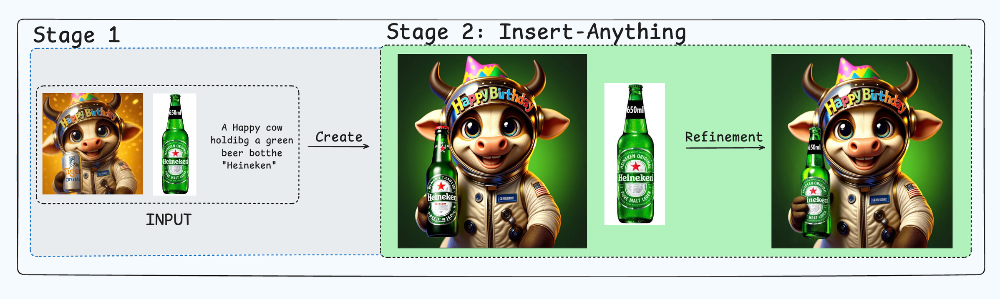
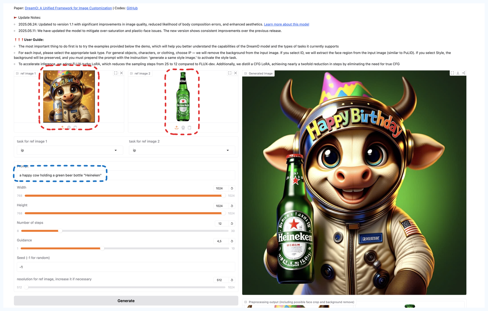
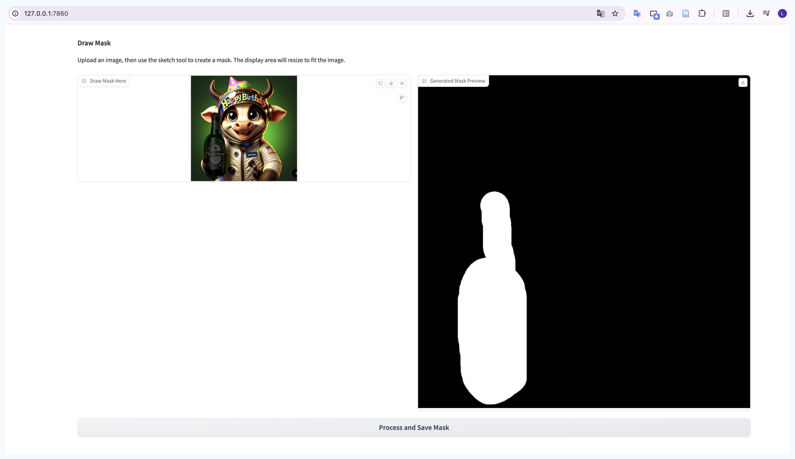
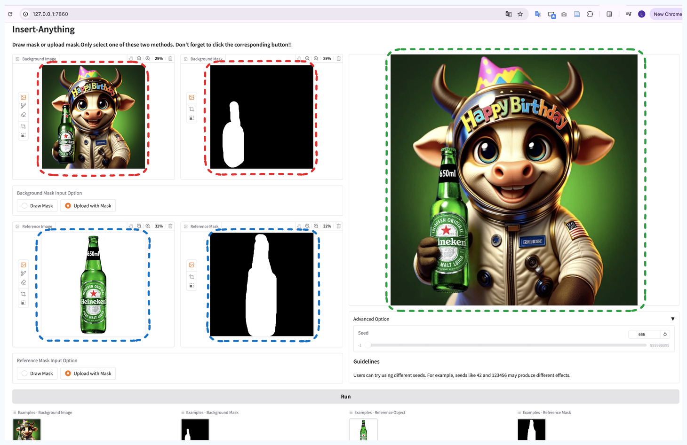
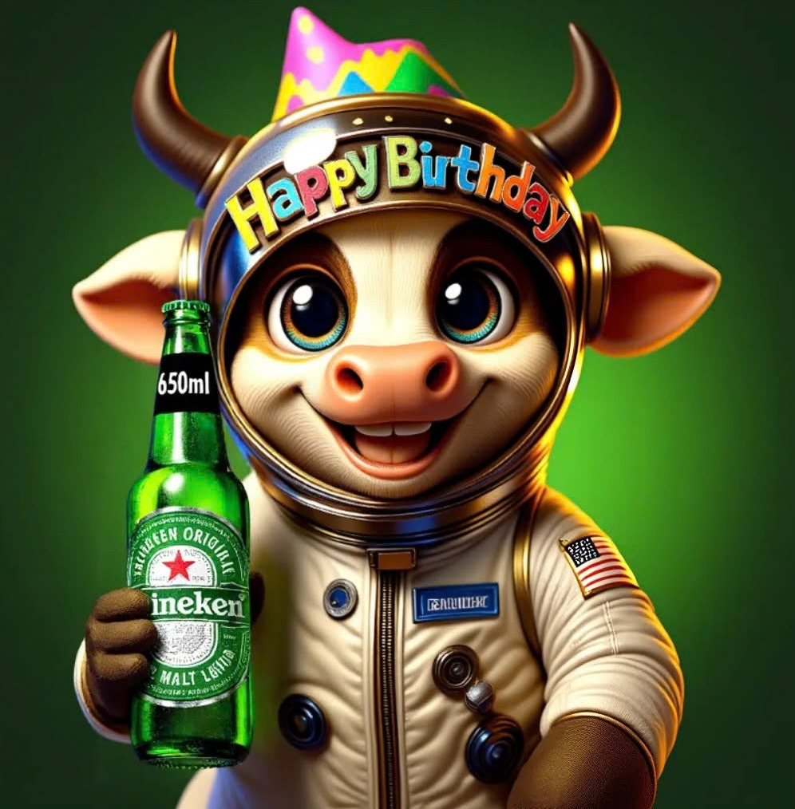

# BrandRefinement



## Overview

BrandRefinement is a two-stage pipeline that helps generate and refine brand product images for advertising purposes. The system combines:

- **Image Customization** - Based on [DreamO](https://github.com/bytedance/DreamO)
- **Image Refinement** - Based on [Insert Anything](https://github.com/song-wensong/insert-anything)

## Installation

```bash
git clone https://github.com/DinhLuan14/BrandRefinement.git
cd BrandRefinement

conda create --name brandrefine python=3.10
conda activate brandrefine

pip install -r requirements.txt
```

## Usage Guide

The workflow consists of 2 main stages:

### Stage 1: Image Generation

Generate product images by combining your creative background with brand product references.

**Run the generation app:**

```bash
python app_gen.py
```

**Inputs:**

- `assert/original.png` - Original background image or character for advertising
- `assert/ref_image.png` - Brand product reference image
- Prompt describing the desired scene

**Example result:**



The generated image will contain the product, but may have some inconsistencies with the original brand product that need refinement.

---

### Stage 2: Draw Masks

Create masks for the objects that need refinement.

**Run the mask drawing app:**

```bash
python app_draw.py
```

**Process:**

- Draw mask for the generated object from Stage 1 → saves to `assert/source_mask.png`
- Draw mask for the reference brand product → saves to `assert/ref_mask.png`

**Mask drawing interface:**



_See example masks: [source_mask.png](assert/source_mask.png) | [ref_mask.png](assert/ref_mask.png)_

---

### Stage 2: Refinement

Refine the generated product to match the original brand product exactly.

**Run the refinement app:**

```bash
python app_refine.py
```

**Inputs:**

- `assert/source_image.png` - Generated image from Stage 1
- `assert/source_mask.png` - Mask of object to refine
- `assert/ref_image.png` - Original brand product image
- `assert/ref_mask.png` - Mask of reference product

**Refinement interface:**



_Input images: [source_image](assert/source_image.jpg) | [source_mask](assert/source_mask.png) | [ref_image](assert/ref_image.png) | [ref_mask](assert/ref_mask.png)_

**Final result:**



Enjoy your refined brand advertising image!

---

## Project Structure

```
BrandRefinement/
├── app_gen.py          # Stage 1: Image generation
├── app_draw.py         # Stage 2: Mask drawing tool
├── app_refine.py       # Stage 3: Image refinement
├── assert/             # Example images and outputs
├── dreamo/             # DreamO module
├── models/             # Model weights
├── utils/              # Utility functions
└── requirements.txt    # Dependencies
```

## Credits

This project is built upon:

- [DreamO](https://github.com/bytedance/DreamO) - Image customization
- [Insert Anything](https://github.com/song-wensong/insert-anything) - Image refinement

## License

Please refer to the original projects for license information.
